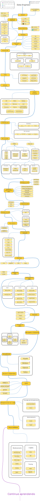

# Roadmap Definitivo para Engenheiro de Dados

Este roadmap serve como um guia para aqueles que desejam se tornar engenheiros de dados. Ele oferece uma visão geral dos tópicos essenciais e das tecnologias mais utilizadas na área.

## Tópicos Principais

- **Fundamentos de Programação**: Linguagens como Python e SQL são essenciais.
- **Armazenamento de Dados**: Bancos de dados relacionais e NoSQL.
- **Processamento de Dados**: Apache Spark, Apache Kafka, etc.
- **Cloud Computing**: Plataformas como AWS, GCP e Azure.
- **Ferramentas de Orquestração**: Apache Airflow, Prefect.
- **Monitoramento e Qualidade de Dados**: Ferramentas para garantir a integridade dos dados.
- **Segurança de Dados**: Boas práticas para proteção de dados sensíveis.

## Como Usar este Roadmap

1. **Estude cada tópico** de forma sequencial ou de acordo com suas necessidades.
2. **Pratique com projetos reais** para aplicar os conceitos aprendidos.
3. **Mantenha-se atualizado** com as novas ferramentas e técnicas do mercado.

O roadmap não é definitivo, mas serve como um ponto de partida sólido para sua jornada na engenharia de dados.

